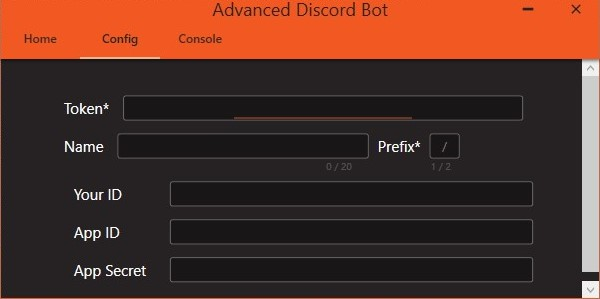
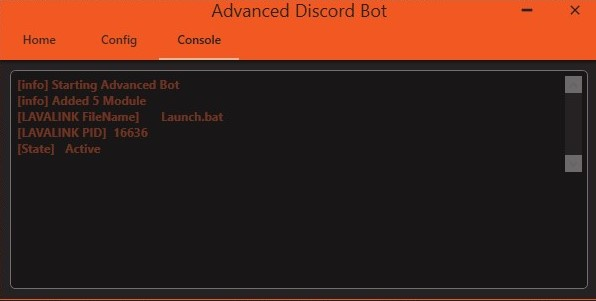

# ADB v2.0

## Overview

This project is meant is a base to build on top of it by adding your custom commands.

### Simple Modern UI




### Easy Config


### Logging



### Base Features

- Help
- Music

## Discord Portal Configuration

Enable all **Privileged Gateway Intents** in [Discord Portal](https://discord.com/developers/applications/)

### Setup

1. Install Latest Java JDK
   1. Install [Java JDK 13](https://www.oracle.com/java/technologies/javase-jdk13-downloads.html)
   2. Install [Java JDK 15](https://www.oracle.com/java/technologies/javase-jdk15-downloads.html) (Recommended)
2. Install Latest Java JRE That Support Your JDK Version
   1. Install [JRE8](https://www.oracle.com/java/technologies/javase-jre8-downloads.html) (Recommended)
3. Set [Java System Environment Variables](https://confluence.atlassian.com/doc/setting-the-java_home-variable-in-windows-8895.html)
4. Move Files in Lavallink folder to your debug folder where the application launch

If everything was setup correctly this terminal command should return this
java -version
```
java version "15.0.1" 2020-10-20
Java(TM) SE Runtime Environment (build 15.0.1+9-18)
Java HotSpot(TM) 64-Bit Server VM (build 15.0.1+9-18, mixed mode, sharing)
```

### Linux(ubuntu)

Check installed architectures

**1. Verify 64-bit architecture. The following command should respond with "amd64".**
_dpkg --print-architecture_

**2- See if 32-bit architecture is installed. The following command should respond with "i386".**
a. dpkg --print-foreign-architectures
If "i386" is not displayed, execute the following.
b. sudo dpkg --add-architecture i386

**3. Recheck with.**
a. dpkg --print-foreign-architectures

**4. Add the WineHQ Ubuntu repository.**
a. wget -nc https://dl.winehq.org/wine-builds/winehq.key
b. sudo apt-key add winehq.key

**5. Add the repository.**
a. sudo add-apt-repository 'deb https://dl.winehq.org/wine-builds/ubuntu/ focal main'

**6. Update the package database.**
a. sudo apt update

**7. Install Wine.**
a. sudo apt install --install-recommends winehq-stable

**8. Verify the installation succeeded.**
a. wine --version

_You are done for now_

**To download .netcore 3.1 on the wine.**

[.netcore 3.1](https://dotnet.microsoft.com/download/dotnet-core/3.1) (download windows version)

## Credits

UI inspired by [BinaryBunny](https://www.youtube.com/c/BinaryBunny/featured).
